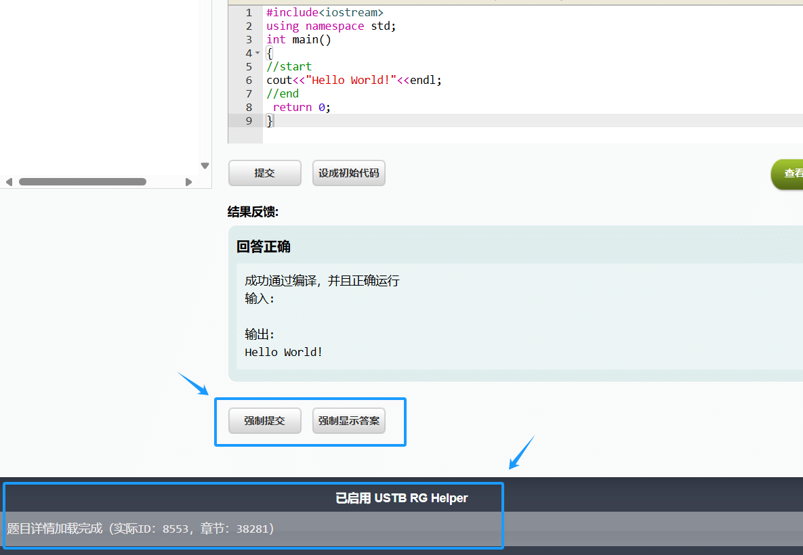
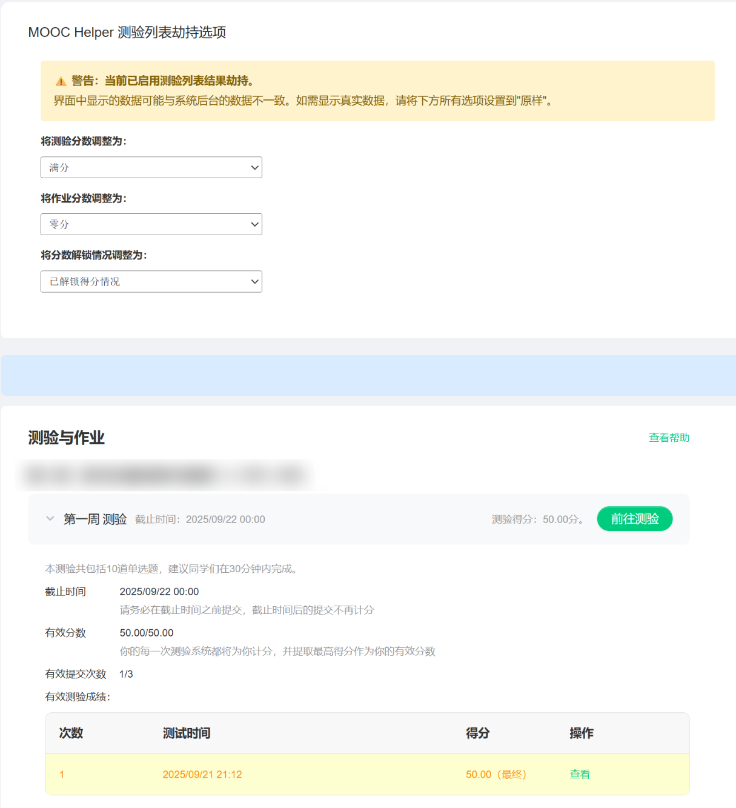
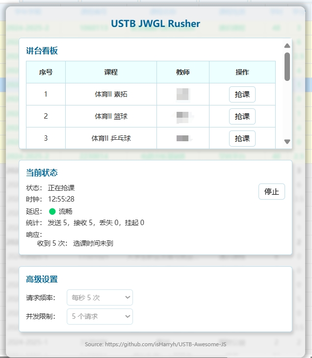

USTB-Awesome-JS
==========
USTB Awesome JS Tools  
北京科技大学线上平台辅助脚本合集

 This project only supports Chinese docs. If you are an English user, feel free to contact us. 

## 介绍 Intro

本项目包含了针对北京科技大学的各类线上平台而开发的浏览器脚本。目前支持的平台如下：

### 锐格平台

脚本文件 `USTB-RG-Helper.js` 是针对北京科技大学程序设计考试平台（简称锐格平台，内网访问 http://ucb.ustb.edu.cn ）的辅助工具，具有如下功能：

1. 新增**显示参考答案**的功能。
2. 新增**强制提交**（包括强制补交）答案的功能。
3. 解决无法**选取和复制**网页中的文本的问题。
4. 优化题目截止时间的显示。
5. 调整少量界面样式。

当锐格平台脚本正常运行时，页面底部会显示相应的提示。

<b>效果预览图</b>

   

<b>开发者点评</b>

锐格平台，前端设计非常陈旧，而且提交答案和查看答案等业务逻辑都只有前端检测，根本没有后端检测，漏洞和错误层出不穷。很轻易地，我们就能实现仿造请求等越权操作。

### 网易慕课

脚本文件 `MOOC-Helper.js` 是针对中国大学 MOOC（简称网易慕课，公网访问 https://www.icourse163.org ）的辅助工具，具有如下功能：

1. 在测验列表页面可以**修改所有测验的分数显示**（仅修改显示结果，不会影响真实分数），并且自动生成有效测验记录的显示。
2. 在测验列表页面可以**强制解锁或锁定得分情况**，可以在没有付费的情况下查看真实分数。
3. 提交至少一次课程测验后即可**在测验详情页面查看参考答案**，无需消耗所有测验次数后再查看（此功能目前可能失效）。
4. 在某些按钮旁边显示“上次访问”提示，以便用户查找。
5. 移除主页的顶部广告，优化某些界面样式。

<b>效果预览图</b>

   

### 超星学习通

脚本文件 `Chaoxing-Helper.js` 是针对超星学习通的辅助工具，具有如下功能：

1. 在测验详情页面提供**紧凑视图**，以便复习和打印题目。

### 教务管理抢课

**已弃用：教务管理系统已于 2025 年更换了新的系统，此脚本已失效。**

脚本文件 `USTB-JWGL-Rusher.js` 是针对北京科技大学本科生教务管理系统的选课中心的抢课工具，具有如下功能：

1. 访问课程列表后，自动获取讲台信息，并将课程信息显示在独立的可拖动的操作面板中。
2. 在操作面板中，可以针对指定的课程班进行抢课，即按照一定的频率向后台发送选课请求。
3. 在操作面板中，可以显示当前抢课的状态（如延迟、响应记录等）。

<b>效果预览图</b>

   

<b>实战测试结果</b>

经过实战测试发现，由于服务器的承载能力有限，无论是否使用抢课脚本，都很难抢到课。如果想提高选课成功率，建议在<strong>校园网环境下</strong>选课。

## 使用方法 Usage

1. **在浏览器中安装脚本管理器插件。**  
   推荐的浏览器是 [Edge 浏览器](https://www.microsoft.com/zh-cn/edge/download) 或 [Chrome 浏览器](https://www.google.cn/chrome/index.html)。推荐的脚本管理器插件是 [TamperMonkey 篡改猴](https://www.tampermonkey.net/)。
2. **在脚本管理器中添加脚本文件。**  
   在本仓库的 `src` 文件夹中，找到所需的 JS 脚本文件并下载，然后将其导入到脚本管理器（把文件内容复制到篡改猴的脚本编辑器里保存，或者直接导入整个文件）。
3. **打开对应的线上平台即可运行。**  
   如果网页已经打开，则需要刷新才能启动脚本。如果仍然无法生效，请在管理扩展的页面中勾选开发人员模式。

> 👉 [**在这里查看详细的图文教程**](docs/Installation.md)

## 许可证 Licensing
本项目基于 **MIT 开源许可证**，详情参见 [License](https://github.com/isHarryh/USTB-Awesome-JS/blob/main/LICENSE) 页面。
