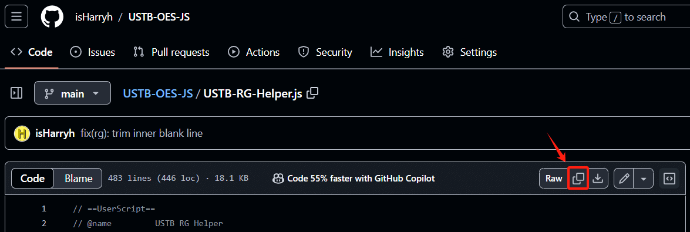

USTB-Awesome-JS 附加文档
# 详细安装教程

## Edge 浏览器

### 在浏览器中安装脚本管理器插件

1. 在 Edge 浏览器右上角的“更多选项”处，点击“扩展”。  
   

2. 在弹出的“扩展”窗口中，点击“获取 Microsoft Edge 扩展”。  
   

3. 在扩展商店的页面中，搜索“篡改猴”关键词，并点击进入“篡改猴”（不是测试版）。  
   

4. 在扩展详情的页面中，点击“获取”、“安装”等类似按钮，并等待安装完成（安装完成后可能会弹出一个简介网页，关闭即可）。  
   

### 在脚本管理器中添加脚本文件

5. 回到第 2 步的“扩展”窗口，可以发现篡改猴已安装，此时点击进入“篡改猴”，随后点击“添加新脚本”。  
   

6. 在脚本编辑页面中，删除编辑区域内的所有初始代码（一定要确保全部清除）。  
   

7. 回到我们的 GitHub 仓库，在文件列表中找到你想要的脚本，点击进去，然后点击“复制”按钮。  
   

8. 回到第 6 步的脚本编辑页面，粘贴刚刚复制的脚本代码到编辑区域中，然后点击菜单栏的“文件”-“保存”。  
   

### 打开对应的线上平台即可运行

9. 登录（或者刷新）线上平台的网页，此时脚本应该就生效了。如果仍然没有生效，请回到第 5 步的“扩展”窗口，点击“管理扩展”，并在管理页面中勾选“开发人员模式”，再刷新线上平台的网页。  
   

---
> 本图文版权归作者所有，转载请注明出处。
